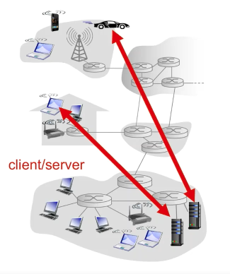
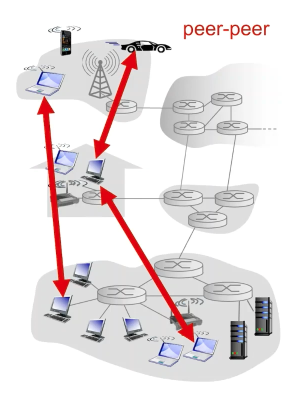
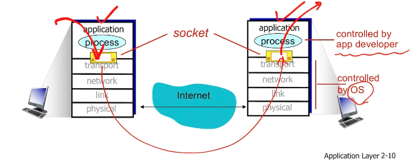
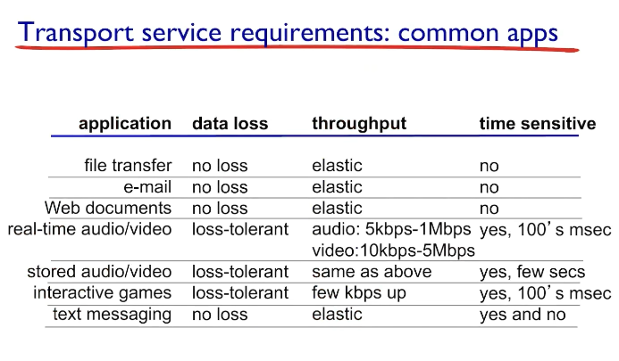
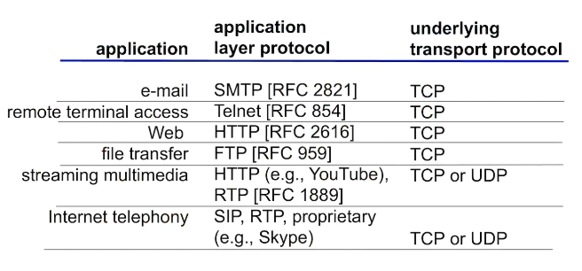

# Ch 2-1 Principles of Network Applications

네트워크 애플리케이션들의 예시

- 이메일
- 웹
- 텍스트 메시지
- 원격 로그인
- P2P

네트워크 애플리케이션 개발

- 네트워크 애플리케이션을 개발할 때, [end systems](https://en.wikipedia.org/wiki/End_system) (네트워크에 연결된 기기) 위에서만 작동하면 되며, 네트워크의 코어 디바이스는 신경쓰지 않아도 됩니다.
- 예컨대 웹 애플리케이션은 브라우저에서만 잘 작동하면 됩니다.
- 라우터는 각 애플리케이션의 행동에 관여하지 않습니다. (관여하지 않아도 됩니다)
- 추상화된 네트워크는 애플리케이션 개발 및 전파를 용이하게 합니다.

## 애플리케이션 아키텍쳐

- Client-server arch.
- Peer-to-peer (P2P)

### Client-server architecture

Server

- 항상 켜져있고 접근 가능합니다 (always-on).
- 고정 IP 주소를 사용합니다.
- 스케일링을 위한 데이터 센터가 필요합니다.

Client

- 서버와 커뮤니케이션합니다. 클라이언트끼리 직접 소통하지 않습니다.
- 상시 연결되어 있지 않을 수도 있습니다. (intermittently)
- 동적 IP 주소를 사용할 수도 있습니다.

### P2P architecture

- Always-on server가 존재하지 않습니다.
- Peer, 즉 임의의 end system끼리 직접 커뮤니케이션합니다.
- Peer가 요청을 보내면 다른 peer가 응답합니다.
- Self scalability: Peer의 존재 자체가 곧 서버이고 capacity입니다. 즉 새로운 peer가 추가되면 그것만으로도 이미 스케일링되었다는 것입니다.
- Downside: Peer들은 마찬가지로 상시 연결되어 있지 않을 수도 있고, 동적 IP 주소를 사용할 수도 있습니다. 이는 관리의 복잡성을 야기합니다.

## Processes commuicating

프로세스 간 커뮤니케이션

- 같은 호스트 안에 있는 두 프로세스는 OS에서 정의한 IPC 등으로 커뮤니케이션할 수 있습니다.
- 다른 호스트에 있는 두 프로세스는 네트워크를 통해 커뮤니케이션할 수 있습니다.
- 이때 client와 server, P2P의 peer는 프로세스입니다. Client는 요청을 보내어 커뮤니케이션을 시작하고, server는 요청을 받아 응답합니다. Peer는 두 속성을 모두 갖습니다.

### Socket

- OS는 소켓(socket)이라는 인터페이스를 제공해 두 프로세스가 네트워크를 통해 커뮤니케이션할 수 있게 합니다.
- 프로세스는 소켓이 열려있는 동안 연결된 프로세스와 메세지를 주고받을 수 있습니다.
- 내부 동작은 OS 및 네트워크 저수준 계층에서 처리합니다.
- 프로세스는 여러 개의 소켓을 가질 수 있습니다.

### Addressing processes

- IP 주소로 호스트 디바이스를 특정할 수 있습니다. 대신 한 호스트의 여러 프로세스 중 하나를 특정할 수는 없습니다.
- **포트 번호**를 사용해 프로세스를 특정할 수 있습니다. 16비트 숫자입니다. (0~65535)
- 몇몇 포트 번호는 [특정 프로토콜에 예약 또는 할당](https://en.wikipedia.org/wiki/List_of_TCP_and_UDP_port_numbers)되어 있습니다. 예컨대 80번은 HTTP, 25번은 SMTP 메일 프로토콜입니다.

### App-layer protocol defines

프로토콜은 메세지에 대해 다음 요소들을 정의하는 규칙입니다.

- types: request, response 등
- syntax: 메세지의 특정 필드 파싱 규칙 등
- semantics: 각 필드의 의미 등
- rules: 메세지를 주고받는 순서나 방법 등

대표적인 프로토콜

- Open protocols: RFC 표준으로 정의된 프로토콜입니다. 표준을 따르면 생기는 [상호운용성](https://ko.wikipedia.org/wiki/%EC%83%81%ED%98%B8%EC%9A%B4%EC%9A%A9%EC%84%B1)이 (interoperability) 큰 장점입니다. 예컨대 HTTP, SMTP, FTP 등이 있습니다.
- Proprietary protocols: 특정 회사나 단체에서 정의하고 소유한 프로토콜입니다. 예컨대 Skype 등이 있습니다.

### What transport service does an app need?

- Data integrity: 데이터가 손상되지 않고 전달되어야 합니다. 파일 전송 등의 몇몇 앱들은 100% reliability를 요구합니다. 다만 음성전화 등의 몇몇 앱들은 loss-tolerant 합니다.
- Timing: 몇몇 앱들은 데이터가 저지연으로 (low delay) 전달되어야 합니다.
- Throughput: 몇몇 앱들은 명시적으로 최소 [throughput 또는 bandwidth](https://darkstart.tistory.com/141)를 요구합니다. TCP 표준에는 최소 throuput이 보장되어 있지 않습니다. 몇몇 elastic app들은 이에 민감하지 않습니다.
- Security: 몇몇 앱들은 암호화 등을 요구합니다. 마찬가지로 TCP 표준에는 보안이 보장되어 있지 않습니다.

## Internet transport protocols services

### TCP

- Reliable transport
- Flow control (control by receiver)
- Congestion control (throttle by sender)
- 제공하지 않는 것들: timing, minimum throughput guarantee, security
- Connection-oriented: 3-way handshake로 연결을 맺습니다.

### UDP

- *Unreliable* data transfer
- 제공하지 않는 것들: reliability, flow control, congestion control, timing, minimum throughput guarantee, security
- 하지만 때로는 UDP를 사용합니다.

### Securing TCP

SSL (Secure Sockets Layer)

- 암호화된 TCP 연결을 제공하는 프로토콜입니다.
- Data integrity 또한 제공합니다.
- End-point authentication 또한 제공합니다.

SSL은 애플리케이션 계층에 있습니다.

- 앱을 SSL 라이브러리를 이용해 구현하면, SSL 라이브러리는 TCP에 상호작용합니다.

SSL socket API

- 8장에서 다시 얘기합니다.
