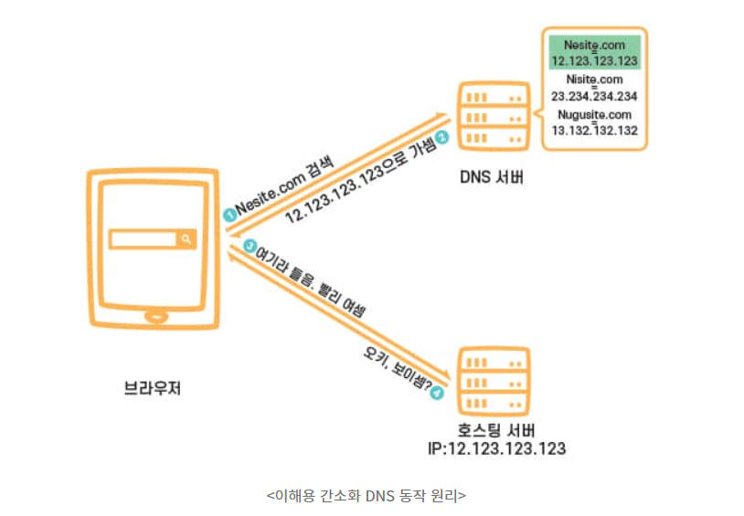
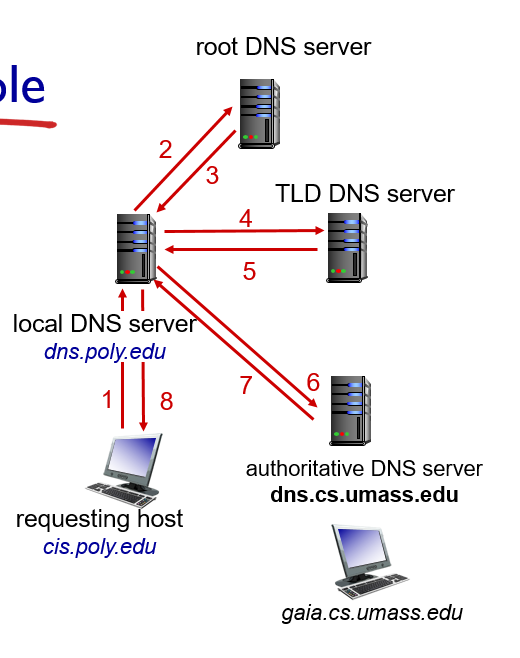
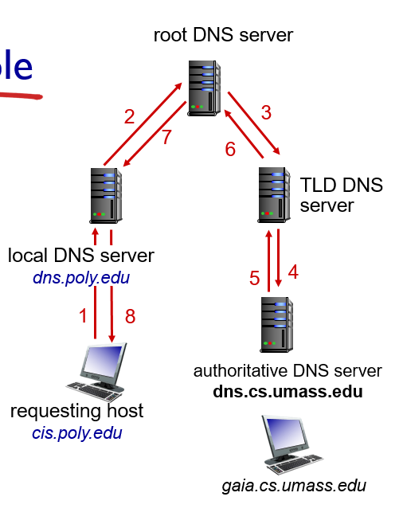
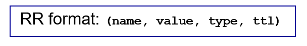

# 2-4 DNS

## DNS란?

DNS(domain name system) 즉 logical host name(ex www.naver.com)과 IP주소(binary일수도 numeric일수도)를 translation하는 것.

- Distributed Database implemeted in hierarchy of many name servers(DNS servers)
- Application-layer Protocol: hosts와 name server가 name을 resolve하기 위해서 communicate한다.
  - core internet function은 application-layer protocol로 implement된다.

### DNS services

- Host aliasing: A host with a complicated hostname can have one or more alias names. 즉 여러개의 hostname을 갖을 수 있다. Canonical과 alias name이다. 예를 들어 relay1.west-coast.enterprise.com은 enterprise.com, www.enterprise.com으로 aliase할 수 있는데 전자를 canonical(original) 후자를 alias names라 부른다.
- Mail server aliasing: Bob이 네이버로 메일을 작성할 때 Bob의 e-mail address는 simple하게 bob@naver.com이 될 것이다. 하지만 naver mail server의 hostname은 더 복잡할 것이다. 이때 DNS가 canonical hostname을 얻기위해서 필요하고 IP address 또한 얻는다.
- Load distribution: 검색하면 load balancing이라 나옴. 이해하기론 naver.com(alias name)가 여러 IP address로 연결되어있다.

### Why not centralize DNS?

- Single point of failure
- Traffic volume
- Distant centralized database
- Maintenance

즉 doesn't scale

## DNS: a distributed, hierarchical database

만약 client가 www.amazon.com이라는 IP를 원하면 다음과 같은 단계를 거친다.

- Client queries(요청들) root server to find com DNS server
- Client queries .com DNS server to get amazon.com DNS server
- Client queries amazon.com DNS server to get IP address for www.amazon.com

즉 3개의 DNS server가 계층구조를 이루고 있다.

### Root name(DNS) servers

- 전 세계에 13개의 root server만 존재한다.

### TLD servers(top-level-domain)

- responsible for com, org, net ect and all top-level country domains, e.g.: uk, fr, ca, kr
- Network Solutions(회사이름) maintains servers for .com TLD
- Educause(회사이름) for .edu TLD

### Authoritative servers

- 회사의 own DNS server이다.
- Can be maintained by organization or service proovider

### Local DNS servers

- 계층에 속하지 않는 서버이다.
- [ISP](https://ko.wikipedia.org/wiki/%EC%9D%B8%ED%84%B0%EB%84%B7_%EC%84%9C%EB%B9%84%EC%8A%A4_%EC%A0%9C%EA%B3%B5%EC%9E%90)가 local DNS 서버를 갖고 있다.
- Host가 DNS query를 만들면 query가 local DNS server에 보내진다.
- Acts as proxy('대리'의 의미로 빠른 액세스나 안전한 통신등을 확보하기 위한 중계서버), forwards query into hierarchy

## Example

간단하게 보면 이렇게 된다.

좀 더 자세하게 강의안에 있는 그림은

## Recursive query의 경우 다음과 같다.

Caching을 이용한다. 즉 어느 정도 시간 전에 어떠한 host가 예를 들면 dns.nyu.edu의 IP address (hostname은 cnn.com)을 요청했다고 가정하면 만약 내가 dns.nyu.edu의 IP 주소를 요청하면 caching에 의해 local DNS server에서 바로 cnn.com에 대한 IP address를 반환할 것이다.

cached entry들은 may be out-of-date이다. 즉 name host가 IP address를 바꾸면 Internet-wide는 모든 TTL(cache 유지 시간)이 끝나기 전에 모를 것이다? (이거 해석이 잘 안돼)

TTL이 만약 5분이면, 5분이 지나기 전에 name host에 연결된 IP address가 바뀌면 문제가 된다!

## DNS records

DNS: distributed database storing resource records(RR)

4가지 타입이 존재한다.

name = key이 name 바탕으로 mapping되는 value를 찾겠다. 이 mapping을 record라 부르고.

- type = A: name = hostname(relay1.bar.foo.com), value = IP address
- type = NS(name server): name = domain(foo.com), value is hostname(dns.foo.com) -> (sub domain) of authoritative name server for this domain.
- type = CNAME: name = alias name, value = canonical name for a hostname. -> 상위 domain이 바뀌는 경우 (ex. youtube.com, youtu.be) 외부 resource에 연결.
- type = MX: value = name of mailserver associated with name (mail.bar.foo.com)

## 아니 근데 어려운게 이름이 계속 바뀌어서 나오는데 내가 이해하기론 name server = DNS server이고 hostname이 domain인건가? 이게 alias name인거고

## Inserting records into DNS

만약 Network Utopia라는 새로운 회사가 있다고 가정하면

- Register name networkutopia.com at DNS registrar(Network Solutions)

  - Provide names, IP addressed of authoritative name server(primary and secondary)
  - registrar inserts two RRs into .com TLD server:

        (networkytopia.com, dns1.networkutopia.com, NS)
        (dns1.networkutopia.com, 212.212.212.1, A)

  - Create authoritative server type A record for www.networkutopia.com; type NS record for networkutopia.com

type A는 우리의 Web server를 저장하는거고 type MX는 mail server를 저장하는 것

## Attacking DNS

### DDoS attacks

- Bombard root servers with traffic
  - not successful to date
  - traffic filtering
  - local DNS servers cache IPs of TLD servers. allowing root server bypass
- Bombard TLD servers
  - Potentially more dangerous

### Redirect attacks

- Man-in-middle
  - Intercept queries
- DNS poisoning
  - Send bogus relies to DNS server, which caches
  - 다르게 Cache Poisoning이라 불리기도 하는데 cache에 저장된 IP 주소를 조작해 자신이 원하는 주소로 보내는 것

### Exploit DNS for DDoS

- 대량의 traffic을 보내서 서버 및 주변 인프라에 액세스 할 수 없도록 하는 공격이다.
- 수업에서 without computer IP라 하셨는데 이게 뭔지 잘 모르겠음
