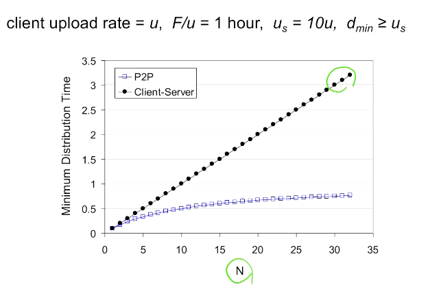

# Ch 2-5 P2P Applications

## Pure P2P architecture

- Always-on server가 존재하지 않습니다.
- Arbitrary end systems(peers)끼리 직접 커뮤니케이션합니다.
- Peer는 intermittently connected 일 수 있고, IP 주소가 변경될 수도 있습니다.
- 예시: file distribution (BitTorrent), streaming (KanKan), VoIP (Skype)

## File distribution: in comparison with client-server

- 업로드 및 다운로드 capacity는 한정된 리소스입니다.
- 크기가 $F$인 파일을 $N$개의 client에게 배포해야 할 때, $u_s$를 server의 upload capacity(혹은 upload rate), $d_i (i = 1, 2, ..., N)$를 client의 download capacity라고 합시다.

### File distribution time in client-server

- **Server transmission**은 파일을 순차적으로 N번 발생합니다.
  - 파일을 1번 전송할 때, $F/u_s$의 시간이 걸립니다.
  - 파일을 $N$번 전송할 때, $NF/u_s$의 시간이 걸립니다.
- **Client**는 각자가 서버로부터 파일을 온전히 다운로드합니다.
  - $d_{min}$을 가장 다운로드가 느린 client의 download rate라고 합시다.
  - 최악의 client가 다운로드할 때, $F/d_{min}$의 시간이 걸립니다.
  - 보통 최악의 상황을 가정하므로 이를 지표로 삼겠습니다.
- Time to distribute F to N clients: $D_{C-S} \ge \max\{NF/u_s, F/d_{min}\}$
  - 이때 C-S는 Client-Server를 의미합니다.
  - 서버의 upload capacity, 가장 느린 client의 download capacity 중 더 오래 걸리는 시간입니다.
  - *$N$이 커진다면...* 서버의 업로드 부하가 선형 증가합니다.

### File distribution time in P2P

- **Server transmission**은 F개의 비트에 대해 적어도 1번씩 발생해야 합니다.
  - 그래야 peer들의 비트를 조합하면 1개의 완성본이 나옵니다.
  - 파일을 1번 전송할 때, $F/u_s$의 시간이 걸립니다.
- **각 peer**는 F개의 비트를 온전히 다운로드해야 합니다.
  - 최악의 client가 다운로드할 때, $F/d_{min}$의 시간이 걸립니다.
- **N개의 peer**는 N개의 파일을 N개의 peer와 server로부터 다운로드받을 수 있습니다.
  - N개의 파일 업로드가 최대 $(u_s + \sum d_i)$의 rate로 이루어지므로, $NF/(u_s + \sum d_i)$의 시간이 걸립니다.
  - 이때 다운로드는 이미 위에서 최악의 경우를 상정했으므로 고려하지 않습니다.
- Time to distribute F to N clients: $D_{P2P} \ge \max\{F/u_s, F/d_{min}, NF/(u_s + \sum d_i)\}$
  - 서버의 upload capacity, 가장 느린 client의 download capacity, 서버 및 peer들의 평균 upload capacity 중 더 오래 걸리는 시간입니다.
  - *$N$이 커진다면...* peer 숫자도 많아지므로 업로드 부하가 선형 증가하지 않습니다.

### File distribution: P2P vs C-S

## P2P file distribution: BitTorrent

- 파일을 256Kb 크기의 chunk로 나눕니다.
- Peer들은 chunk를 주고받습니다.
- **Tracker**는 서버이며, peer에게 현존하는 peer들의 정보를 알려줍니다. 즉, metadata는 centralized server에서 관리됩니다.
- **Torrent**는 파일의 chunk를 주고받는 peer들의 집합입니다.

### BitTorrent protocol

1. Peer가 torrent에 참여합니다. 이때는 어떠한 chunk도 없으며 다른 peer들로부터 축적하게 될 것입니다.
2. Peer는 tracker에게 자신의 존재를 알리고, 다른 peer들의 정보를 받습니다.
3. Peer는 그중 몇몇 peer(neighbor)들에게 연결합니다.
4. Peer는 다운로드를 받으며 동시에 자신이 가진 chunk들을 다른 peer들에게 업로드합니다.
5. **Churn**: 각 peer는 도중에 나타나고 사라지면서 변경될 수 있습니다.
6. Peer가 파일을 모두 받았다면, 떠나거나 (selfishly), 계속 업로드 (altruistically) 할 수 있습니다.

### Requesting chunks

- 서로 다른 peer들은 서로 다른 chunk들을 가지고 있습니다.
- Peer는 다른 peer에게 chunk 목록을 요청하고, 자신이 없는 chunk 중 가장 rarest한 것을 우선적으로 요청합니다.

### Sending chunks: tit-for-tat

- Peer는 자신에게 chunk를 가장 많이 보내는 4개의 peer에게 chunk들을 보냅니다. 다른 peer들은 choked 상태이며, 이 top 4는 10초마다 재계산합니다.
- **Optimistically unchoke**: 매 30초마다 무작위 peer를 선택해서 chunk를 보냅니다. 이를 통해 해당 peer가 top 4로 선정될 여지를 두어 기회를 줍니다.

### 참고: DHT

- Tracker는 BitTorrent 프로토콜의 capacity를 제한하는 유일한 요소입니다.
- DHT (distributed hash table): tracker는 성능을 위해 peer의 chunk 정보를 저장하고 있지 않습니다.
