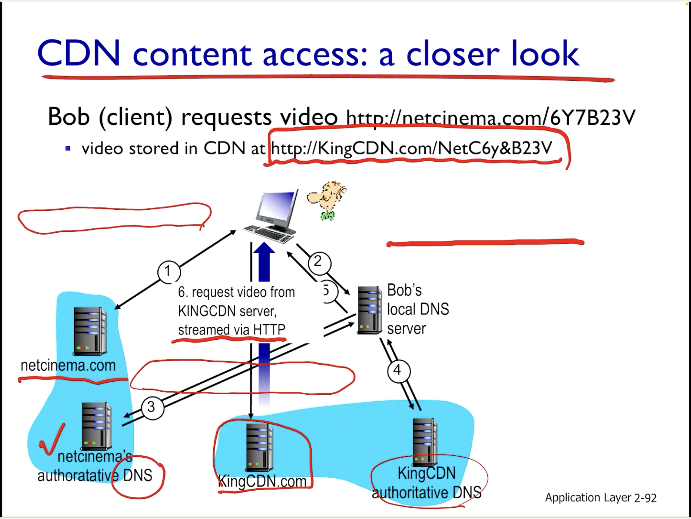
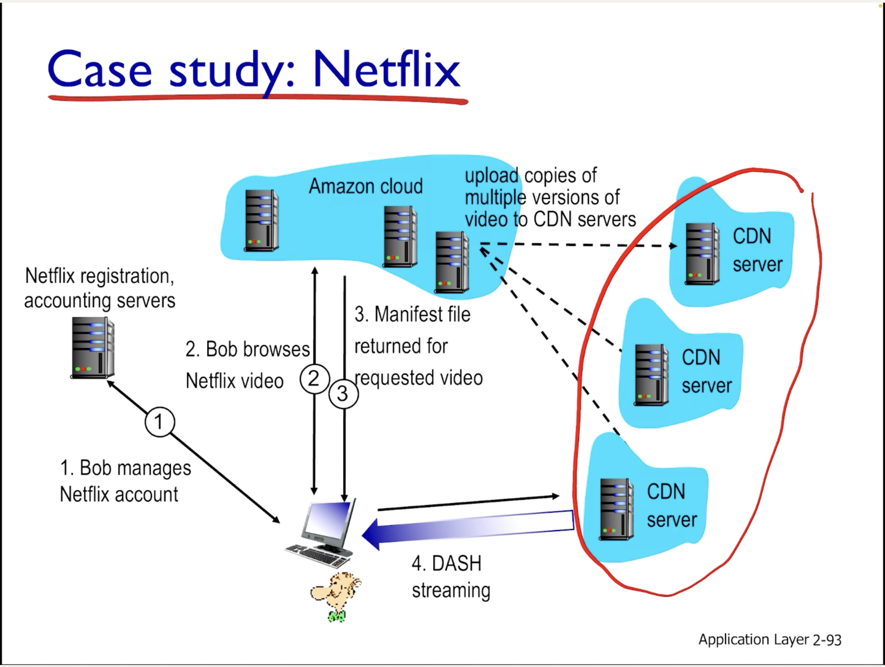

# Ch 2-6 video streaming and content distribution networks(CDNs)

- CDN이라 불리는 비디오 스트리밍 성능을 향상시키기 위한 네트워크 인프라 구조에 대해 배운다. 

## Video Streaming and CDNs: context

- 현재 인터넷 트래픽의 50퍼센트가 동영상 스트리밍 시스템일 정도로 인터넷 트래픽을 많이 잡아먹은 부분이다.
- 비디오 스트리밍 서비스가 힘든 이유로는 첫째, 사용자 수와 영상의 수가 많다는 점과 둘째, 각각의 디바이스의 조건(최대 화질, 인터넷 속도)등이 다르기 때문이다. - heterogeneity

## Multimedia: video

- 비디오 자료가 어떻게 만들어 지는지부터 시작한다.
- redundancy와 spatial coding을 이용하여 모든 프레임의 사진을 다 저장하는 것보다 데이터 양을 줄인다.
- redundancy때문에 매 프레임의 데이터 양은 달라질 것이고, 따라서 영상의 매 시간마다 데이터 양도 달라질 것이다.
- CBR과 VBR의 차이점은 시간에 따라 트레픽이 달라지냐 달라지지 않냐의 차이인데, 요즘은 VBR을 사용한다고 한다.(위에서 기술한데로 redundancy를 사용하면 매 초 데이터 양이 달라지므로, VBR이 더 효율적이기 때문에)

## Streaming stored video:

- **Streaming stored video**저장되어 있는 동영상 파일을 스트리밍 하는 것으로, 인터넷이 않좋으면 버퍼링이 생길 수 있다.
- **Realtime video streaming**은 비디오를 생성하지 않고 스트리밍하는 방법이기에, 긴 버퍼링 시간이 생기면 안된다.

## Streaming multimedia: DASH
- Dynamic, Adaptive Streaming over HTTP의 약자
- 우리가 보는 영상의 화질이 Adaptive하기 때문에 Adaptive Streaming이다.
- **Server**는  
  - 영상을 여러개의 청크(예를 들면 1초 단위의 청크)로 나누고
  - 청크마다 여러개의 화질로 영상 데이터를 만든 뒤,
  - 그 URL들을 manifest file에 넣어서 클라이언트한테 보낸다.
- **Client**는
  - 서버와 클라이언트사이의 대역폭을 예측하여
  - 적절한 화질의 데이터 정보를 선택한 뒤
  - 선택한 화질의 URL로 부터 청크 데이터를 받아온다
- 따라서 DASH는 클라이언트가 언제, 어떠한 화질의 영상을 어떠한 서버로 부터(DASH에서는 Multiple server를 지원하므로 여러개의 서버에 영상이 있을 수 있다.) 가져오는지를 결정해야 한다.

## Content Distribution networks
- 엄청 많은 사용자에게 엄청 많은 동영상을 제공하기 위해, 스트리밍 서비스들은 싱글 서버 대신 CDN을 이용한다.
- CDN은 웹 캐시와 비슷한 개넘으로, 동양상 파일의 복사본을 여러개의 캐시 서버에 저장해두고, 그 서버로부터 클라이언트가 동영상을 받아오는 방법
- Akamai라는 회사에서 처음 사용한 방법이다.
- 오리지널 서버로부터 manifest file을 받아온 뒤, 주변에 있는 캐시 서버로부터 영상을 받아온다.
- CDNs를 이용하여 스트리밍 서비스를 제공하는 OTT service의 경우, 어떠한 CDN서버에 어떠한 영상을 넣을지 생각해야 한다.

## CDN content access: a closer look

