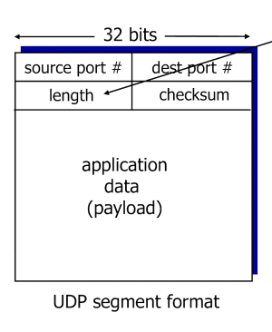
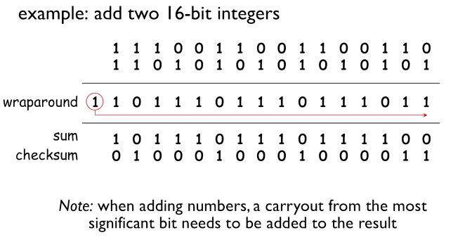

# Connectionless Transport: UDP

## UDP: User Datagram Protocol

- [RFC 768](https://www.rfc-editor.org/rfc/rfc768)
- "No frills", "bare bones" internet transport protocol
- UDP segments는 손실될 수 있고, 전송 순서가 보장되지 않습니다.

Connectionless

- UDP는 handshaking을 통한 sender/receiver 사이의 연결 설정 과정이 없습니다.
- 각각의 UDP segment는 독립적인 것으로 취급됩니다.

UDP 사용 사례

- Streaming multimedia applications: loss tolerant한 대신 rate sensitive
- DNS
- SNMP

UDP를 reliable하게 만드는 방법

- 만약 필요하다면...
- Application layer에 reliability 처리를 추가할 수 있습니다.
- 애플리케이션마다 각자의 유즈케이스에 맞는 error recovery를 구현할 수 있습니다. 즉 DIY

## UDP segment header

- 아주 간단한 헤더 구성입니다.
- Source 포트
- Destination 포트
- Length: UDP segment의 헤더와 데이터를 합친 바이트 단위 길이
- Application data (payload)

참고: [UDP payload 최대 길이](https://scrapsquare.com/notes/udp-length)

## UDP의 장점

- Connection establishment로 인한 delay가 없습니다.
- Connection의 state를 sender, receiver가 유지할 필요가 없어 간단합니다. 소켓에 클라이언트별 커넥션을 열어둔다던지 그럴 필요가 없습니다.
- 헤더 크기가 작습니다.
- TCP에는 있는 congestion(부하) control이 없어 이로 인한 오버헤드가 없습니다. 필요하면 즉시 보내면 됩니다.

## UDP checksum

- Flipped bits 등의 오류를 검출하기 위함입니다.
- Sender는 segment의 16 bit checksum을 계산해 헤더 체크섬 필드에 추가합니다.
- Receiver는 checksum을 계산하고, 헤더의 checksum과 비교합니다.
- 서로 다르면 오류가 발생했다고 판단합니다.
- 하지만 서로 같다고 해서 오류가 없는 것은 아닙니다. 이에 관한 내용은 나중에 다룹니다.
- 최근에는 유선 연결이 매우 reliable하고, 무선 연결에는 내장된 아주 복잡한 오류 체크 시스템이 있어서, UDP checksum을 경시하는 경우가 많습니다.

