# 3-4 Principles of Reliable Data Transfer

- Application/transport/link layer에서 아주 중요한 주제
- 네트워크 주요 주제 top 10 중 하나

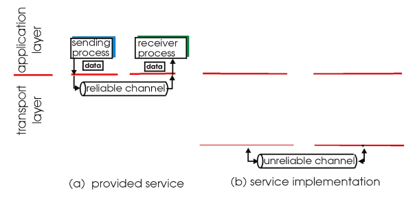

- Application layer는 transport가 제공하는 channel이 reliable하다고 가정합니다.
- Transport layer는 internet link의 channel이 unreliable하다고 가정합니다.
- Transport layer에서 unreliable한 underlying channel을 reliable하게 만들어서 제공해야 합니다.

## RDT: Reliable Data Transfer protocol

[RDT protocol](https://en.wikipedia.org/wiki/Reliable_Data_Transfer)

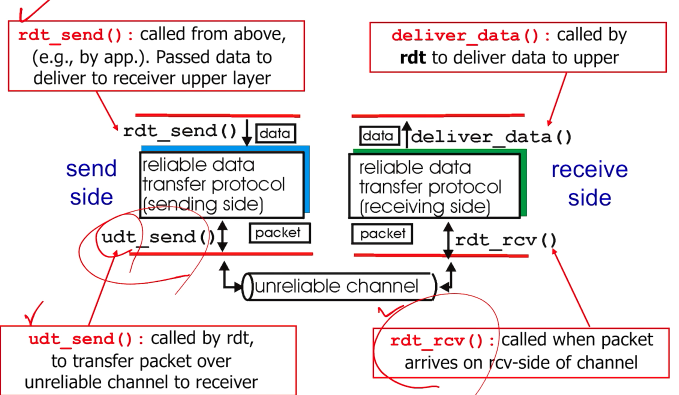

- RDT는 네트워크 분야의 주요 토픽 이름입니다.
- RDT protocol은 현실에 존재하는 프로토콜이 아닌 예시입니다. RDT라는 토픽을 해결하는 전형적인 방법을 FSM과 step by step으로 보여줍니다.
- RUDP, RDP 등과 헷갈리지 맙시다.
- 참고: 함수 이름은 예시입니다. Udt는 unreliable data transfer의 줄임말입니다.

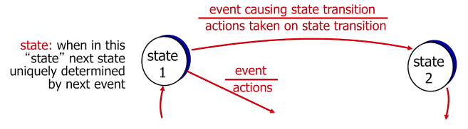

- FSM(finite state machine)을 사용해 sender, receiver의 상태 및 행동을 정의합니다.

## RDT 1.0: reliable transfer over a reliable channel

- 그럴 일은 현실에 없지만, 비트 에러나 패킷 손실이 없는 underlying channel을 가정합니다.

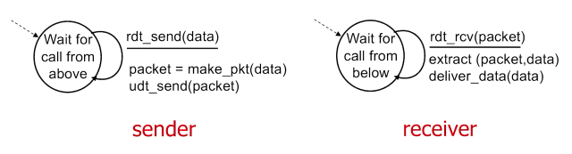

## RDT 2.0: channel with bit errors

- 비트 에러(flip)가 있는 underlying channel을 가정합니다.
- 체크섬을 사용해 에러를 검출합니다.
- ACK(acknowledgement): Receiver가 packet을 성공적으로 받았다는 것을 알립니다.
- NAK(negative acknowledgement): Receiver가 packet에 에러가 있음을 알립니다. 이 경우 sender는 packet을 재전송합니다.

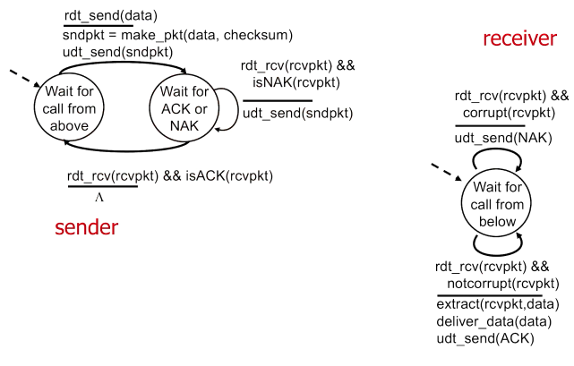

- lambda: no operation
- 자세한 건 강의 PPT나 영상에 애니메이션이 있으니 하나씩 보셔도 좋습니다.

## Fatal flaw of RDT 2.0

Corrupted ACK/NAK

- Sender는 receiver에서 무슨 일이 일어나고 있는지 모릅니다.
- 패킷을 다시 보내면 duplication이 발생할 수 있으며, 이는 reliable하지 않습니다.

Handling duplicates

- Sender는 receiver의 ACK/NAK 응답이 누락되었다고 생각되면 packet을 재전송합니다.
- Sender는 packet에 [sequence number](https://eunhyee.tistory.com/246)라는 일종의 패킷 ID를 붙입니다.
- Receiver는 sequence number를 사용해 중복된 packet을 discard합니다.

Stop and wait

- Sender는 packet을 보내고 ACK/NAK 응답을 기다립니다.

## RDT 2.1: handles garbled ACK/NAKs

Sender

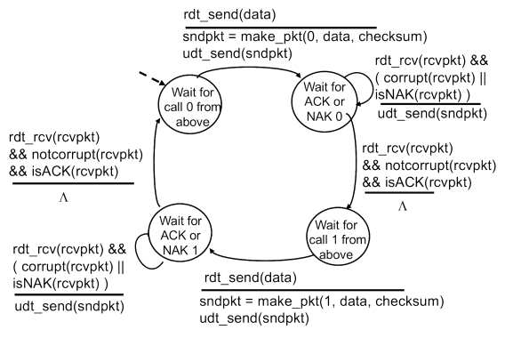

- 패킷에 sequence number를 붙입니다.
- (최적화를 위해) 0, 1, 0, 1, ...의 토글 방식입니다.
- 그 외에는 2.0과 거의 동일합니다.

Receiver

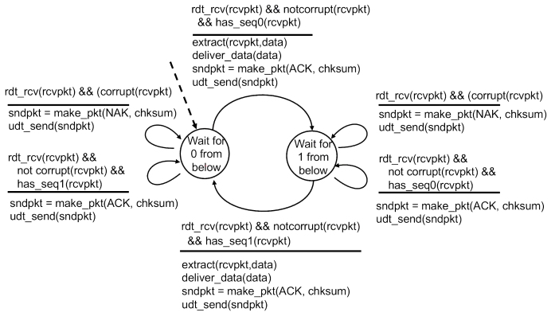

- Sequence number를 통한 중복 패킷 처리를 추가합니다.
- 그 외에는 2.0과 거의 동일합니다.

## RDT 2.2: a NAK-free protocol

- NAK를 사용하지 않고도 reliable한 프로토콜을 만들 수 있습니다.
- Receiver가 ACK에 sequence number를 포함시킵니다.
- NAK는 직전 ACK와 sequence number가 같은 경우로 대체합니다.
- Sender는 NAK를 받은 것으로 간주합니다.

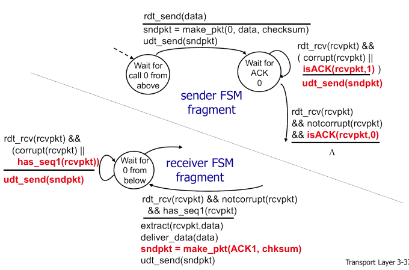

## RDT 3.0: channel with errors and loss

새로운 가정

- Underlying channel에 **패킷 손실** 가능성을 추가합니다. 이는 data, ACK 패킷 모두에 적용됩니다.
- Checksum, sequence number, ACK, 재전송만으로는 부족합니다.

접근법

- Sender는 ACK가 오기까지 reasonable한 시간을 기다립니다.
- Sender는 timeout이 발생하면 packet을 재전송합니다.
- 패킷이나 ACK가 손실이 아니라 단순 지연이었다면 재전송한 패킷은 duplication일 수 있습니다. 이는 sequence number를 통해 처리합니다.
- Receiver는 ACK 패킷에 sequence number를 포함시킵니다.

참고

- TCP는 이러한 sender buffering, timer 테크닉 등에 의해 UDP에 비해 복잡합니다.

Sender

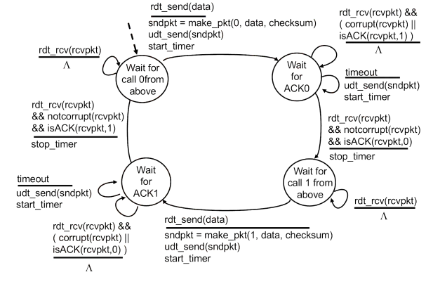

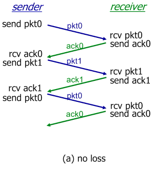

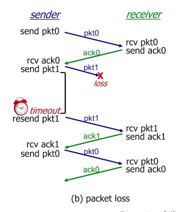

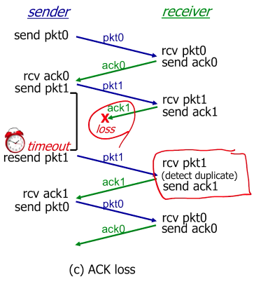

- Sequence number가 같은 패킷이 두 번 왔으므로, receiver는 두 번째 패킷을 discard합니다. 즉 상위 layer로 패킷을 보내지 않습니다.

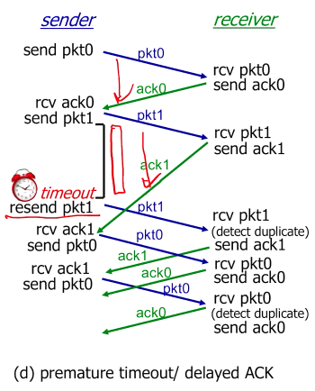

- 이런 복잡한 상황이 생길 수 있습니다.
- 그래도 중복되는 것들은 discard하므로, 작동 자체는 잘 됩니다.

### Performance of RDT 3.0

- RDT 3.0은 correct하지만, performance가 좋지 않습니다.

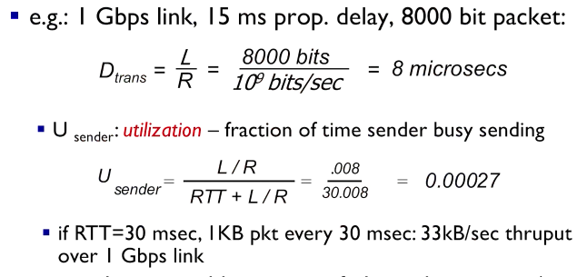

- L: Packet length
- R: Link rate. 즉, 1초에 link할 수 있는 bit 수
- $D_{trans}$: 실제 packet link에 소요되는 시간
- $U_{sender}$: Utilization. 이 식을 유의깊게 봐둡시다.
- RTT: Round trip time. 패킷을 link하기 완료한 시점부터 응답 패킷을 완전히 받는데까지 걸리는 시간. 즉, sender의 손을 떠나고 기다리기만 하는 시간
- 숫자들은 예시이지만 일반적으로 reasonable한 값들입니다.

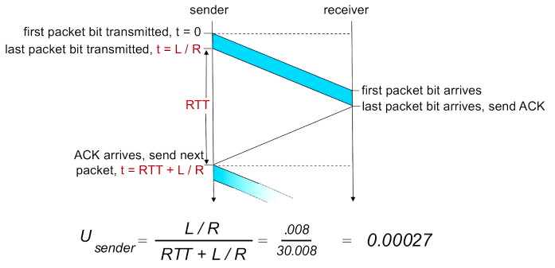

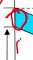

- 실제로 D가 차지하는 부분은 이것밖에 안 됩니다.
- 그래서 utilization이 주어진 가정 하에 0.00027이라는 처참한 수치가 나옵니다.

## Pipelined protocols

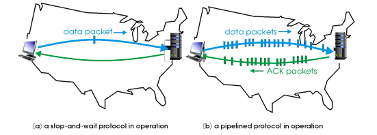

- Sender가 언젠가 보낼 예정인, yet-to-be-acknowledged packet들을 보냅니다.
- Sequence number는 toggle이 아닌 increasing number로 바뀝니다.
- 적어도 sender, receiver 둘 중 하나에 buffering이 필요합니다.
- 두 가지 형태가 있습니다: **go-back-N**, **selective repeat**
- Pipelining은 TCP의 핵심 디자인이며, 추후 다시 다룹니다.
