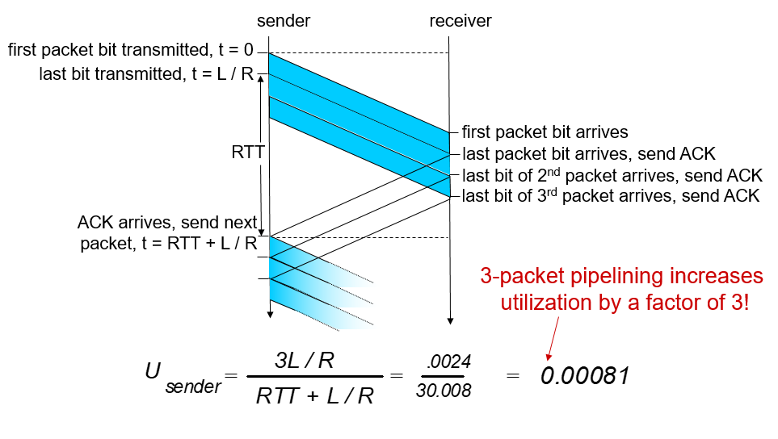
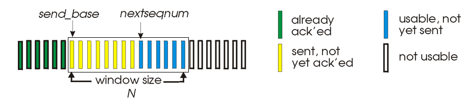
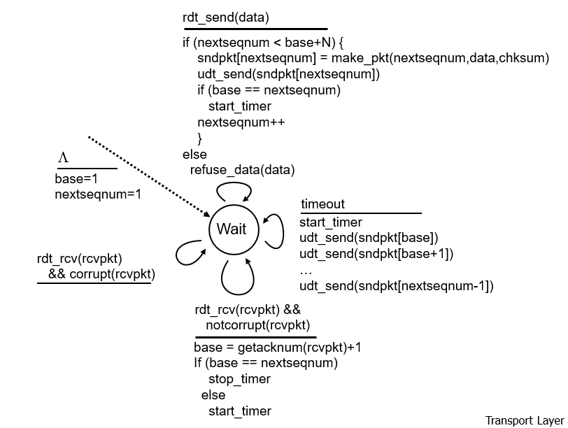
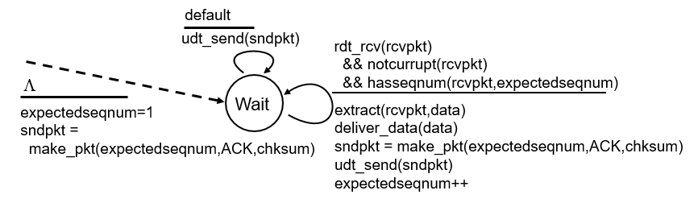
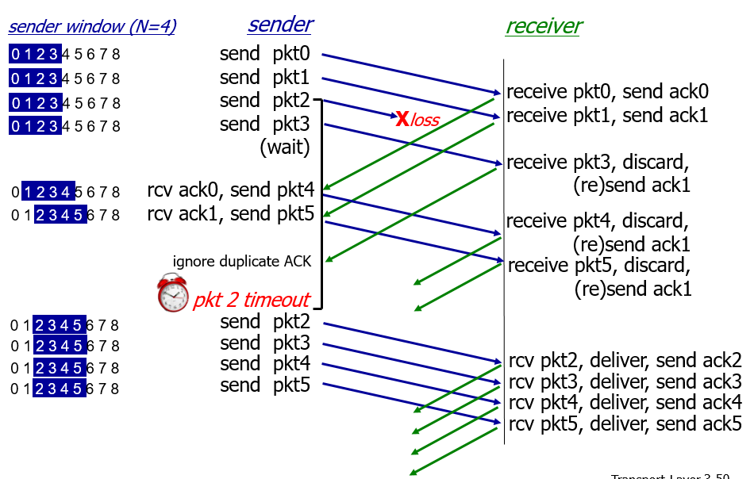
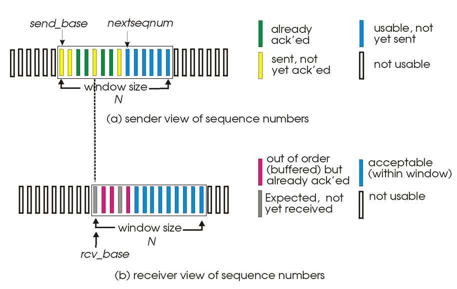
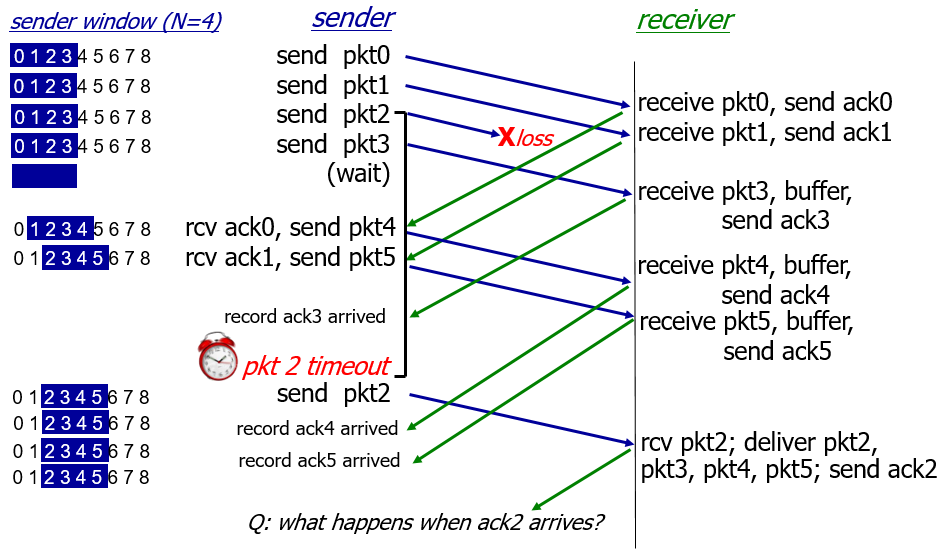
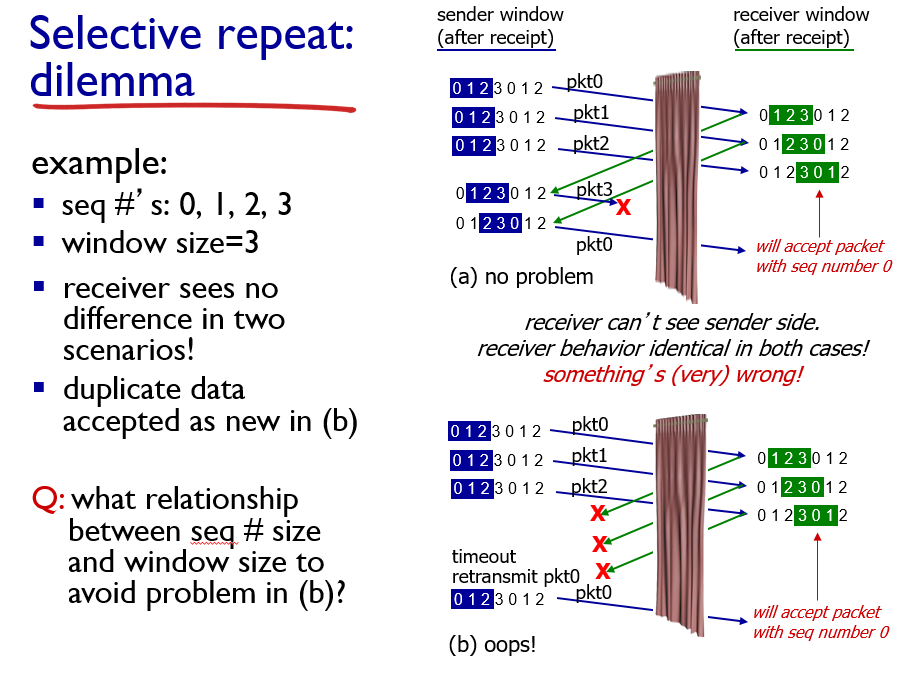

# 3-4 Piplined Protocols

우리가 컴아나 OS에서 배운 pipline과 동일하다고 생각하면 편함.

이전까지는 한 번 sender가 보낼 때 하나의 data packet만 보냈는 데 이는 시간이 너무 많이 걸리니까 여러개의 data packet을 한 번에 보내겠다.

1. Go-Back-N
2. Selective Repeat

이 그림에서는 한 번에 3개의 data packet을 보내는 데 이는 pipeline의 depth가 3이라는 뜻과 동일하다.

위에서 말한 2가지 pipelined protocol이 존재한다.

## Go-Back-N

일단 단순하게 말하면 그룹으로 주고 받는다고 생각하면 편하다.

- N의 경우 depth를 말하는 것이고 한 번에 주는 packet이라 생각하면 된다.
- Cumulative ack라는 단어가 나온다. 이는 만약 내가 packet number가 0 ~ 5까지인 packet을 sender가 보냈고 만약 receiver가 어떠한 이유로 0, 1, 2, 4, 5 packet만 받고 3번 packet을 못받았으면 receiver는 2번 ack만 보내는 것이다. 만약 그렇게 되면 sender는 3 ~ 5 packet을 다시 보내야 한다.
- 이로 인해 sender는 oldest unacked packet의 timer만 갖게 된다.
- 장점으로는 lower implementation하다.

### Sender

어차피 Go Back에서는 그룹으로 왔다갔다 하기 때문에 send_base가 ack를 받으면 window를 오른쪽으로 움직일 수 있다.

이거 아마 교수님께서 circular queue로 구현한다고 하신 것 같다.

딱히 설명은 안하고 넘어가셨지만 sender의 입장에서 어떻게 돌아가는지 나와있는 그림이다.

### Receiver

Receiver의 입장에서는 0 ~ 5의 packet 중 3번 packet만 오지 않았지만 Go Back protocol이기 때문에 2번의 packet에 대한 ack만 sender에게 generate한다.

이는 highest _in-order_ seq #을 갖는다는 특징이 있다. (Generate duplicate ACKS) -> 이거 얘기 하시면서 1, 2, 3, 4(missing), 5 이렇게 되면 3을 다시 생성.

Out of order pkt에 대해서는 discard(don't buffer) 즉 receiver는 buffer를 갖지 않는다. 이는 sender는 어차피 다시 보낼 것이기 때문이다.

뭐 있어도 되긴 하다. TCP designer는 single implementation을 하지 않는다. 전체적인 틀은 똑같지만 그 안에서의 detail들은 os마다 다르기 대문에 buffer가 있어도 되고 없어도 된다.

## Selective Repeat

Go-Back과는 다르게 individual하게 ack이 움직인다고 생각하면 된다. 따라서 이는 unnecessary transmission을 줄여준다.

따라서 sender의 경우 unacked packet에 대해 각각의 timer를 갖고 있어야 한다.

가장 큰 차이점은 receiver도 window slide가 있다는 점이다.

- Sender의 경우 already acked인 녹색칸으로 모든 window가 채워져야만 옆으로 이동한다.
- 또한 receiver의 경우에는 자주색칸으로 모든 window가 채워지면 옆으로 이동한다.

이 그림에서는 pkt2가 missing이지만 다른 pkt은 individual하게 주고 받는 것을 볼 수 있다. 하지만 window는 옆으로 움직이지 못하고 있다.

여기서 말하는 dilemma는 만약 window size가 너무 작아서 다른 pkt이지만 똑같은 pkt number를 갖고 있는 pkt을 식별하는 것에 이상이 생기는 것을 말한다.

예를 들면 (b)를 보게 되면 receiver는 당연히 ack을 보냈기 때문에 window가 움직인다. 하지만 sender 입장에서는 3개의 pkt다 ack이 오지 않기 때문에 다시 0, 1, 2 pkt을 보내게 된다. 하지만 receiver 입장에서는 이것이 똑같은 pkt인지 아니면 다른 pkt인지 구별할 수 없는 상황에 놓기게 된다.

즉 duplicate 된 것은 receiver가 알 수 없는 것이다.

여기에 대해 교수님께서 TCP cannot filter out retransmission. 즉 application layer에서는 구분 가능하지만 transport layer에서는 구분이 불가하다. 이런식으로 말씀하셨는데 내가 제대로 이해한 것인지 조금 헷갈림.
