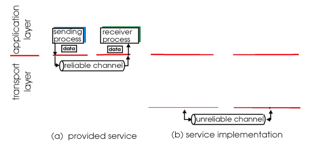
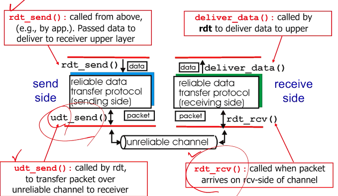
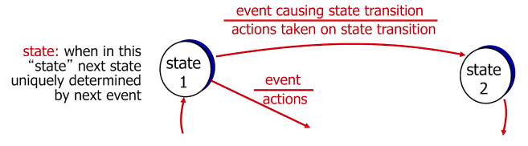
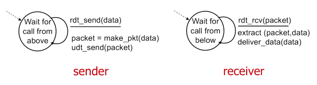
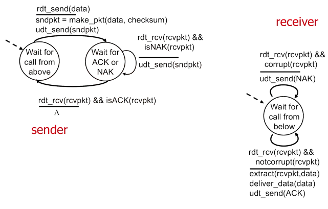

# 3-4 Principles of Reliable Data Transfer (Part 1)

- Application/transport/link layer에서 아주 중요한 주제
- 네트워크 주요 주제 top 10 중 하나

- Application layer는 transport가 제공하는 channel이 reliable하다고 가정합니다.
- Transport layer는 internet link의 channel이 unreliable하다고 가정합니다.
- Transport layer에서 unreliable한 underlying channel을 reliable하게 만들어서 제공해야 합니다.

## RDT: Reliable Data Transfer protocol

- 참고: 함수 이름은 예시입니다. Udt는 unreliable data transfer의 줄임말입니다.

- FSM(finite state machine)을 사용해 sender, receiver의 상태 및 행동을 정의합니다.

## RDT 1.0: reliable transfer over a reliable channel

- 그럴 일은 현실에 없지만, 비트 에러나 패킷 손실이 없는 underlying channel을 가정합니다.

## RDT 2.0: channel with bit errors

- 비트 에러(flip)가 있는 underlying channel을 가정합니다.
- 체크섬을 사용해 에러를 검출합니다.
- ACK(acknowledgement): Receiver가 packet을 성공적으로 받았다는 것을 알립니다.
- NAK(negative acknowledgement): Receiver가 packet에 에러가 있음을 알립니다. 이 경우 sender는 packet을 재전송합니다.

- lambda: no operation
- 자세한 건 강의 PPT나 영상에 애니메이션이 있으니 하나씩 보셔도 좋습니다.

## Fatal flaw of RDT 2.0

Corrupted ACK/NAK

- Sender는 receiver에서 무슨 일이 일어나고 있는지 모릅니다.
- 패킷을 다시 보내면 duplication이 발생할 수 있으며, 이는 reliable하지 않습니다.

Handling duplicates

- Sender는 receiver의 ACK/NAK 응답이 누락되었다고 생각되면 packet을 재전송합니다.
- Sender는 packet에 [sequence number](https://eunhyee.tistory.com/246)라는 일종의 패킷 ID를 붙입니다.
- Receiver는 sequence number를 사용해 중복된 packet을 discard합니다.

Stop and wait

- Sender는 packet을 보내고 ACK/NAK 응답을 기다립니다.

---

이후 내용은 Part 2에서 계속됩니다.
