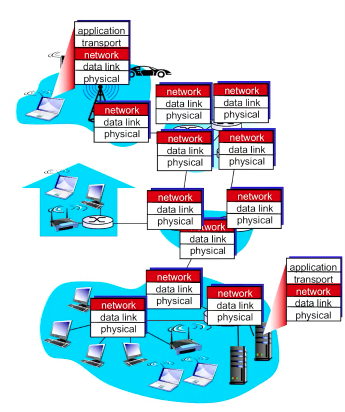
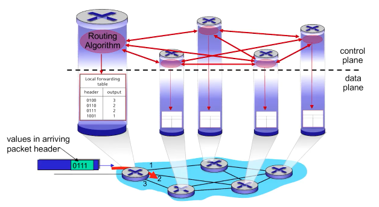
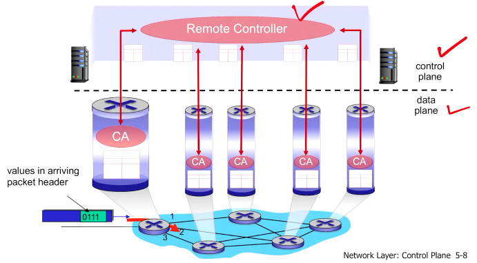
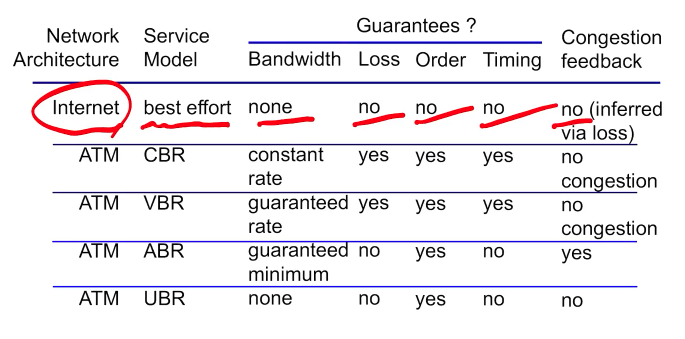

# 4-1 Overview of Network Layer

## Goals of chapter 4

recall, 전송 계층의 **service model**

- reliable data transfer, in-order delivery, ...
- 애플리케이션 계층에 메세지를 올바르게 전달합니다.

네트워크 계층의 service model

- transport layer는 end-device 수준의 issue에만 집중하며, 데이터의 라우팅은 관심갖지 않습니다.
- transport layer protocol은 라우터와 같은 기기에서 구현되지 않습니다.
- 이 데이터 라우팅 및 포워딩을 제공하는 것이 바로 네트워크 계층입니다.

챕터 4의 목표

- understand principles behind network layer services, focusing on data plane:
  - network layer service models
  - forwarding versus routing
  - how a router works
  - generalized forwarding
- instantiation and implementation in the Internet

챕터 5

- 챕터 4에서는 네트워크 레이어에 대해 설명하고, 특히 data plane에 대해 설명합니다.
- 챕터 5에서는 네트워크 레이어의 control plane에 대해 설명합니다.

## Network layer

- Internet layer라고도 부릅니다.
- TCP/IP의 IP를 담당하는 **인터넷 프로토콜(IP)**이 여기에 속합니다.
  - 종종 실생활에서 혼용되는 IP address와 헷갈리지 않게 유의하세요. IP는 프로토콜이고, 아이피 주소는 IP에서 사용하는 개념 중 하나입니다.

- 세그먼트를 sending host에서 receiving host로 전달합니다.
- Sending side에서는 세그먼트를 datagram으로 캡슐화합니다.
- Receiving side에서는 세그먼트를 transport layer로 전달합니다.
- **모든** 호스트, 라우터에 있습니다.
  - 모든 네트워크 카드가 있는, 즉 네트워크와 연결될 수 있는 전자 장치들은 예외없이 network/data link/physical layers를 가지고 있습니다.
  - data link, physical layers는 단일 표준이 아닙니다. 이더넷, LTE 등 여러 종류가 있습니다.
  - 라우팅은 network layer의 핵심이며, 라우터는 다양한 종류의 physical link를 지원할 수 있어야 합니다.

## Two key network-layer functions

- forwarding: 패킷을 라우터에서 다음 라우터로 이동시킵니다. actual function에 가깝습니다. **data plane** issue입니다.
- **routing**: source에서 destination으로 packet을 어떻게 이동시킬지 결정하는 **알고리즘**입니다. logical algorithm에 가깝습니다. **control plane** issue입니다.

## Network layer: two planes

Data plane (forwarding)

- local, **per-router function**. 무조건 각 라우터에서 수행됩니다.
- 주로 destination에 관한 해더를 추출해 정보를 control plane에 전달합니다. control plane에서 어떤 방법으로 전송시킬지 결정합니다.
- control plane의 instruction에 의해 수행됩니다.

Control plane (routing)

- network-wide logic
- 각 라우터에서 수행할 수도 있고, remote controller에서 수행할 수도 있습니다.
- datagram을 라우터에서 라우터로 어떤 방법을 통해 전송할지 결정합니다.
- 알고리즘이 어디에 구현되느냐에 따라 어프로치가 있습니다.
  - traditional routing algorithms: 라우터 안에 구현됩니다.
  - [software-defined networking(SDN)](https://www.geeksforgeeks.org/software-defined-networking-sdn-controller/): newer approach. remote 서버에 구현됩니다. IT 관리자가 네트워크 서비스를 중앙화된 한 지점에서 관리할 수 있습니다. 엔터프라이즈(기업 자체 운영) 및 클라우드 [데이터 센터](https://aws.amazon.com/ko/what-is/data-center/)에서 주로 사용합니다. *아래의 Logically centralized control plane 파트를 읽고 다시 돌아오면 좋습니다.*

### Per-router control plane

- 각각의 라우터가 개별적으로 의사결정합니다.

### Logically centralized control plane

- 위의 per-router control plane과 대비되는 개념입니다.
- distinct(대체로 remote) controller가 의사결정하고 local control agents와 상호작용합니다.
- local control agents는 data plane 기능(forwarding)을 수행합니다.
- 100% centralized는 아닐 수도 있습니다.
- SDN에서 사용되며, 그에 따른 요즘 트렌드로는 데이터 센터 네트워크 등에서 많이 사용됩니다.

## Network layer service models

개별 데이터그램의 서비스 모델 예시

- guaranteed delivery: 상상해봅시다. 만약 네트워크 계층에서 reliable delivery를 제공했다면 TCP같은 전송 계층은 훨씬 간단했겠죠. TCP가 reliable delivery를 위해 사력을 다하는 이유는 네트워크 계층이 제공하지 않기 때문입니다.
- delivery 속도 보장

데이터그램 플로우의 서비스 모델 예시

- in-order datagram delivery
- 플로우에 대한 최소 bandwidth 보장

현실의 네트워크 계층

- **네트워크 퀄리티에 관련된 어떠한 것도 보장하지 않습니다.**
- 위에 써둔 예시 중 어느 것도 보장하지 않습니다. 간단하죠.

- IP에서 네트워크 계층은 best-effort service model을 따릅니다.
  - 현재 IP에서의 유일한 네트워크 서비스 모델입니다. 다른 선택지는 없습니다.
  - 라우터가 congestion이 발생했을 때 sender에게 feedback을 report할 수 있기는 하지만, 원론적으로 IP 아키텍처는 상위 계층에 어떠한 서비스도 제공하지 않습니다.
  - ECN은 TCP 계층의 congestion feedback implementation입니다.
- ATM에서는 선택지가 있습니다.
  - Asynchronous Transfer Mode. 현금인출기가 아닙니다.
  - 자세히 다루지는 않지만, 다른 종류의 네트워크 아키텍처에는 이런 게 있다 정도만 기억합시다.
