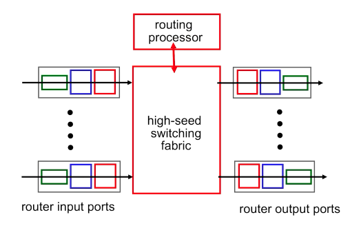
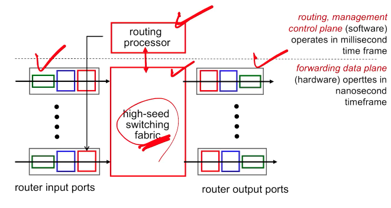
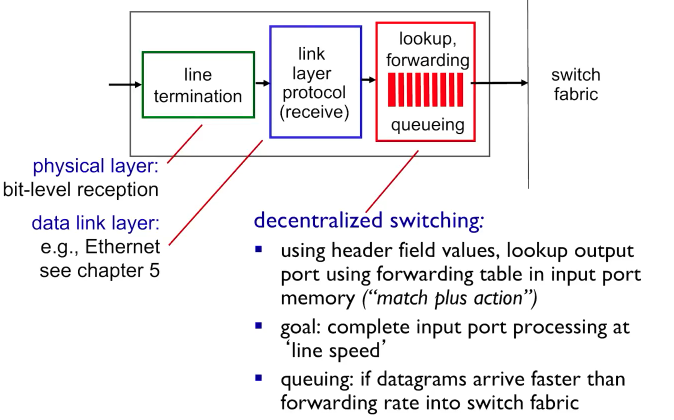
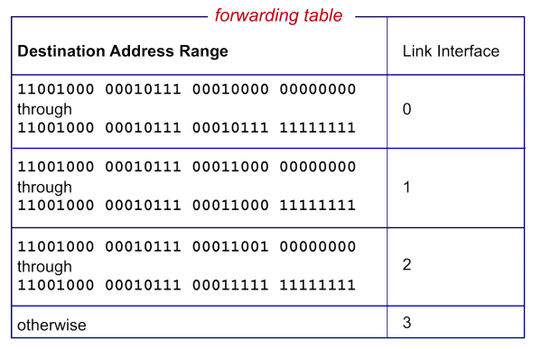
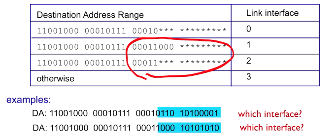

# 4-2 What`s Inside a Router

- 라우터는 여러 네트워크 인터페이스 카드([network interface controller, NIC](https://ko.wikipedia.org/wiki/%EB%84%A4%ED%8A%B8%EC%9B%8C%ED%81%AC_%EC%9D%B8%ED%84%B0%ED%8E%98%EC%9D%B4%EC%8A%A4_%EC%BB%A8%ED%8A%B8%EB%A1%A4%EB%9F%AC))를 가진 컴퓨터로 볼 수 있습니다.
- 데스크탑 컴퓨터로 라우터를 만들 수 있습니다. 실제로 오픈소스 프로젝트 중 Linux Router Project 등이 있습니다.

## Router architecture overview

- Routing processor: 라우팅 알고리즘을 수행할 프로세서(CPU 등)입니다.
- 1개 이상의 NIC들: 그림에는 최소 4개가 있다고 묘사되어 있습니다.
- internal switching fabric: 복잡한 형태의 system bus로 볼 수 있습니다. NIC들을 (심지어는 이더넷, 와이파이 등 서로 다른 종류의 NIC들도) interconnect합니다.
- 다만 전통적인 데스크탑 컴퓨터 형식의 라우터는 Gbps 퍼포먼스를 내기 어려워, 상업용 라우터는 speedup을 위해 프로세서와 switching fabric을 별도의 칩으로 커스터마이징합니다.

- routing, management control plane: software (and hardware hybrid). millisecond time frame 이내에서 작동해야 합니다.
- forwarding data plane: hardware. nanosecond time frame 이내에서 작동해야 합니다.

## Input port functions

- physical layer
- data link layer: Ethernet, Wi-Fi, LTE 등을 처리합니다. **챕터 6**에서 다시 논의합니다.
- forwarding

### Forwarding

decentralized switching

- output port 결정을 중앙이 아닌 input port에서 합니다.
- match plus action: 헤더, 그리고 input port의 자체 메모리에 저장된 forwarding table을 기반으로, output port를 결정합니다.
- 결정되면 switch fabric을 통해 output port로 전송합니다. 참고로 switch fabric은 단순 bus가 아닌, scailability를 위한 매우 복잡한 구조를 갖습니다.
- datagram이 forwading rate보다 빠르게 도착하면, datagram을 queuing합니다.

forwarding by header

- destination-based forwarding: datagram의 destination IP address를 기반으로 forwarding합니다. 전통적인 방식입니다.
- generalized forwarding: 헤더를 가리지 않고 forwarding table 참조에 사용할 수 있습니다. SDN 이후로 등장한 방식입니다.

## Destination-based forwarding

- 매치되는 address range에 따라 포워딩합니다.
- Q: addr range가 멋지게 나눠지지 않으면 어떻게 해야 할까요?

### Longest prefix matching

- 애스터리스크(*)는 wildcard입니다.
- ... 00011*** 과 ... 00011000 의 앞 21비트가 중복됩니다.

Longest prefix matching: 여러 개의 prefix가 매치된다면, 그 중 prefix중 가장 긴 것을 선택합니다.

- 예시 중 첫 번째는 ... 00011*** 이 매치되므로 2번 인터페이스를 선택합니다.
- 예시 중 두 번째는 ... 00011000 이 가장 길게 매치되므로 1번 인터페이스를 선택합니다.
